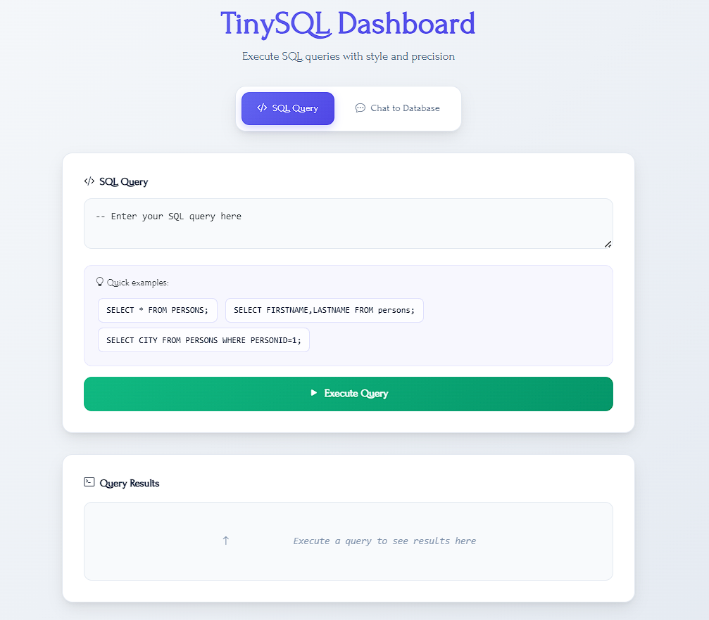
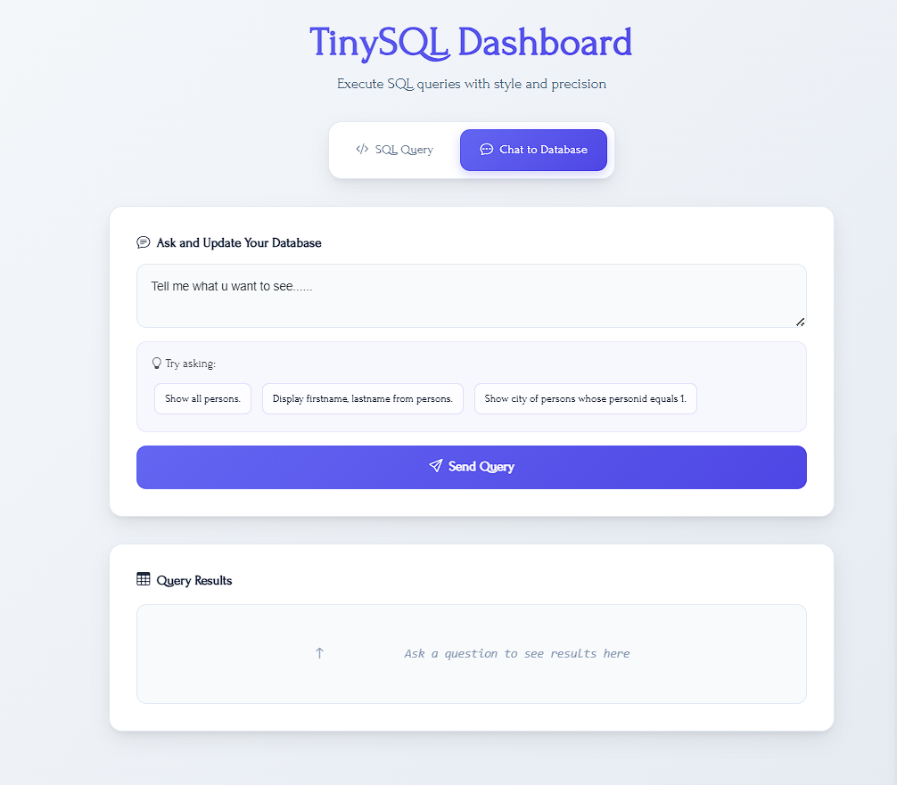

# Tiny-SQL

Tiny-SQL is a lightweight SQL engine built in Python. It includes a custom lexer, recursive descent parser, in-memory data storage, and execution engine to handle basic SQL operations such as `SELECT`, `INSERT`, `DELETE`, `UPDATE`, and `CREATE`.

---

## ✨ Features

- Custom lexer and recursive descent parser
- Basic SQL query support:
  - `SELECT` with optional `WHERE` clause
  - `INSERT INTO`
  - `DELETE`
  - `UPDATE`
  - `CREATE`
- In-memory table management
- Modular structure with extensible components
- Optional chatbot-based SQL query interface (`chattosql.py`)
- Simple web dashboard (`dashboard.py`) for interaction

---

## 📸 Dashboard Screenshots

| SQL Interface                      | Chat to Database                     |
| ---------------------------------- | ------------------------------------ |
|  |  |

---

## 🔧 Project Structure

```
Tiny-SQL/
├── lexer.py         # Tokenizes SQL input
├── parser.py        # Parses tokens into AST (Recursive Descent)
├── executor.py      # Executes SQL commands based on AST
├── storage.py       # Manages in-memory data storage
├── utils.py         # Helper functions
├── chattosql.py     # Chat interface for SQL queries
├── dashboard.py     # Web dashboard using Flask
├── main.py          # CLI entry point
├── requirements.txt # Project dependencies
└── Procfile         # Deployment configuration
```

---

## 🚀 Getting Started

### 1. Clone the Repository

```bash
git clone https://github.com/yourusername/Tiny-SQL.git
cd Tiny-SQL
```

### 2. Install Dependencies

```bash
pip install -r requirements.txt
```

### 3. Run the CLI Tool

```bash
python main.py
```

### 4. Launch the Dashboard (Optional For Better Experience.)

```bash
python dashboard.py
```

---

## 🧠 How It Works

- `lexer.py`: Converts input SQL strings into tokens.
- `parser.py`: Parses the tokens into an abstract syntax tree (AST).
- `executor.py`: Evaluates the AST and interacts with `storage.py` to perform the operations.
- `storage.py`: Acts as a mock database using Python dictionaries.

---

## Using Chat to Database Queries

This system allows users to interact with the database through natural language commands. The chatbot understands various ways of phrasing SQL commands and translates them into proper SQL queries. Below are examples of supported commands for different SQL operations:

### Create Table

You can create tables with commands such as:

- `make table orders with attributes id, name`
- `create table orders having id, name`
- `make table orders with id, name`
- `create table students with id, name, address`
- `make table orders with attribute id`

### Insert Data

Insert records into tables using commands like:

- `add id equals 1, name to Mayank and address to dehradun in student`
- `put id = 2 and name equals to Deepak in orders`
- `insert id to 3, name equals John inside customers`
- `add id to 1, name to deepak into orders`
- `put id =1 and name equals to deepak in orders`
- `insert id to 1, name equals deepak inside orders`
- `add id is 1, name to deepak and order to cake into orders`

### Update Data

Update records with commands such as:

- `update orders change name to deepak whose id equals to 2`
- `update orders replace name equals deepak where id is 2`

### Select Data

#### Select All Records

- `show me all from orders`
- `please display all in customers`
- `could you show me all of products?`

#### Select Specific Fields

- `show me id, name, and age from users`
- `please list name and price in products`
- `get me id and name of orders`

### Delete Data

Delete records using commands like:

- `delete from orders where id is 1`
- `delete orders whose id is 1`
- `delete orders where id = 1`
- `remove orders where id equals 1`

#### Example Expected SQL Query for Delete:

```sql
DELETE FROM orders WHERE id = 1;
---

## 🛠️ Technologies Used

- Python 3
- Flask (for the dashboard)
- Custom-built parsing and execution engine

---

## 🧩 Parser Details

- **Type:** Recursive Descent Parser
- **Why:** Manually implemented parsing functions for each SQL command (e.g., `parse_select`, `parse_insert`, etc.)
- **AST Representation:** Each node is an instance of `ASTNode`.

---

## 📜 License

MIT License

Copyright (c) 2025 Deepak Singh Deopa

Permission is hereby granted, free of charge, to any person obtaining a copy
of this Tiny-SQL software and associated documentation files (the "Software"),
to deal in the Software without restriction, including without limitation the rights
to use, copy, modify, merge, publish, distribute, sublicense, and/or sell
copies of the Software, and to permit persons to whom the Software is
furnished to do so, subject to the following conditions:

The above copyright notice and this permission notice shall
be included in all copies or substantial portions of the Software.

THE SOFTWARE IS PROVIDED "AS IS", WITHOUT WARRANTY OF ANY KIND,
EXPRESS OR IMPLIED, INCLUDING BUT NOT LIMITED TO THE WARRANTIES
OF MERCHANTABILITY, FITNESS FOR A PARTICULAR PURPOSE AND NONINFRINGEMENT.
IN NO EVENT SHALL THE AUTHORS OR COPYRIGHT HOLDERS BE LIABLE FOR ANY CLAIM,
DAMAGES OR OTHER LIABILITY, WHETHER IN AN ACTION OF CONTRACT, TORT OR OTHERWISE,
ARISING FROM, OUT OF OR IN CONNECTION WITH THE SOFTWARE OR THE USE OR OTHER DEALINGS
IN THE SOFTWARE.
```
